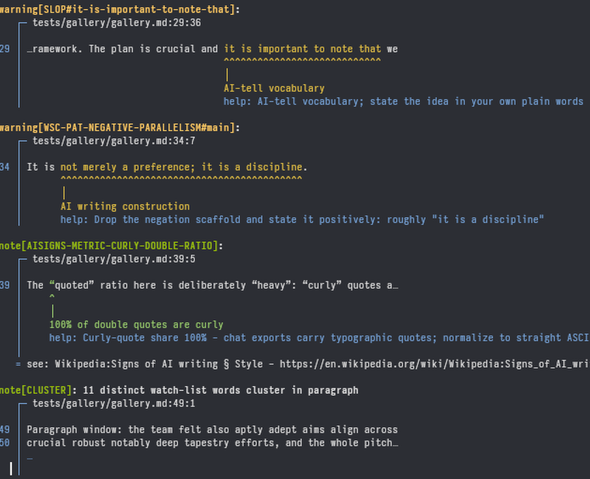

# deslop

A linter for AI-generated writing. It finds the vocabulary, sentence patterns, chatbot markup, and document-level statistics that mark text as machine-written, then tells you what to change. Everything is driven by TOML rule packs — the binary embeds no rules of its own, so tuning behavior is a config edit, not a recompile.



## How it works

Packs load, merge, and deduplicate into a single effective ruleset, then every document goes through a markdown-aware scan: code fences, code spans, and link targets are masked out before any rule runs, so lints never fire on URLs or example code. Findings carry byte-accurate spans and sort deterministically; a run is byte-stable across the three output formats.

Rules are organized into tiers by false-positive risk:

- **Tier 1** — unambiguous artifacts like `[cite: 12, 14, 16]` or a leaked `utm_source=chatgpt.com`. Reported as errors, so these make the run exit 1.
- **Tier 2** — tells like `delve`, "it's not X, it's Y" constructions, and concession scaffolding. Reported as warnings, also exit 1.
- **Tier 3** — density signals like em-dash rate and curly-quote ratio. Reported as hints; matter in aggregate and do not affect the exit code.

Exit codes: `0` clean, `1` findings reported, `2` usage error or failed rule load. A load failure aborts before a single document is scanned.

## Usage

```sh
deslop doc.md                  # lint a file (paths default to `.`)
deslop --format json doc.md    # machine-readable output
deslop fix doc.md              # dry-run mechanical replacements
deslop fix --write doc.md      # apply them
deslop rules                   # list the effective merged ruleset
deslop init                    # write an annotated .deslop.toml
```

`deslop fix` rewrites only vocab entries that declare exactly one `replacement` term. Everything else is report-only: the tool never rewrites prose it cannot justify, and plugin findings are always report-only.

## Install

```sh
git clone https://github.com/jayson-lennon/deslop.git
cd deslop
cargo build --release
install -Dm755 target/release/deslop ~/.local/bin/deslop
cp -r rules/ ~/.config/deslop/rules/
```

Building requires a stable Rust toolchain (`rust-toolchain.toml` pins the stable channel; the workspace MSRV is 1.85). The binary is self-contained; the rules copy is what makes the six builtin packs available in the usual `~/.config/deslop/rules/` location. If you run the binary straight from the repo without copying, `./rules/` resolution picks the packs up anyway.

## Rule packs

A pack is one TOML file with any number of `[[group]]` tables. Seven ship with the tool:

- `aatell` — frequency-measured AI-tell words with suggested rewrites (tier 2)
- `slop` — AI-slop words and phrases (tier 2)
- `wsc` — vocabulary plus structural prose patterns (tier 2)
- `hedging` — structural hedge formulas like concession scaffolding (tier 2)
- `aisigns` — chatbot markup artifacts plus document metrics (tiers 1 and 3)
- `cluster-terms` — a single-word watch list (tier 3)
- `repetition` — document-level repetition: near-verbatim sentences, restated propositions, and one idea spread across many paragraphs (tiers 2 and 3)

Packs resolve from the first location that exists:

1. `--rules-dir DIR`, which skips everything below — useful for CI and tests
2. `~/.config/deslop/rules/` — drop your own TOML files here
3. `./rules/` — repo development layout
4. `<exe_dir>/rules/` — installed layout

## Creating rules

Every rule lives in a `[[group]]` table. The group carries the shared settings and `[[group.entries]]` blocks carry the individual triggers, so one file can hold many groups. The schema rejects unknown fields, and a typo'd key refuses the pack at load rather than being silently ignored. Every entry needs `advice` text, and `must_match`/`must_not_match` fixtures prove each rule works: if a fixture fails, the pack refuses to load with a named entry and sample.

### Group fields

```toml
[[group]]
# Required. Findings and [lints] keys are '<id-base>#<slug>'.
# Unique across all loaded files.
id-base = 'AATELL'

# Required. One of vocab | pattern | literal-ban | metric.
kind = 'vocab'

# Required. 1 = artifact -> error, 2 = tell -> warning,
# 3 = density -> hint. Tier 1/2 findings make the run exit 1.
tier = 2

# Required. Free-form label shown by `deslop rules`.
# Entries may override it per finding.
category = 'ai-vocabulary'

# Optional. Finding headline template. Placeholders depend on kind.
message = '…{match}…'

# Optional. Fix guidance shown under the finding.
advice = '…'

# Optional, default true. false ships the group switched off
# (still visible in `deslop rules`).
enabled = true

# Optional. Where the scan looks:
#   'prose'     visible prose outside code fences (default for vocab/pattern)
#   'heading'   heading text only
#   'list-item' list item text only
#   'anywhere'  whole document (default for literal-ban)
scope = 'prose'

[group.url]
# Optional. Reference rendered with findings.
text = 'WP:AISIGNS'
href = 'https://en.wikipedia.org/wiki/Wikipedia:Signs_of_AI_writing'

[group.fixtures]
# Optional but expected. Every enabled entry must hit every must_match
# sample and miss every must_not_match sample, or the pack refuses to load.
must_match = ['...']
must_not_match = ['...']
```

### Placeholders

| kind                   | allowed placeholders                               |
| ---------------------- | -------------------------------------------------- |
| `vocab`, `literal-ban` | `{match}` — the exact matched text                 |
| `pattern`              | any named capture from the regex, e.g. `{payload}` |
| `metric`               | `{value}`, `{per_words}`                           |
| `repetition`           | `{count}` — the repetition group's member count    |

Literal braces are doubled, so `{{` renders as `{`. Placeholder typos refuse the pack at load time.

### vocab

Word- and phrase-level tells, matched on word boundaries in prose, case-insensitive.

```toml
[[group.entries]]
# Required. Unique within the file. Content-derived: 'leverage', not 'fix-14'.
slug = 'leverage'

# Required. Words or phrases. One entry per concept — list all spellings
# here rather than creating near-duplicate entries.
terms = ['leverage']

# Optional, default false. Expands inflections mechanically
# (leverage -> leverages, leveraged, leveraging): one entry, one ID,
# all forms caught. Use it for single words.
stems = true

# Optional, default true. false means substring match,
# which is rarely what you want for words.
word_boundary = true

# Optional. Lets `deslop fix` rewrite hits mechanically. Requires exactly
# one term so inflected forms rewrite consistently.
replacement = 'use'

# Optional. Overrides the group advice.
advice = 'Replace "{match}" with "use"'
```

### literal-ban

Exact substrings that must never appear — chatbot markup, leaked URLs, rendered citations. Like every kind, it never matches inside code spans, fences, or link targets.

```toml
[[group.entries]]
slug = 'gemini-cite'
advice = 'Replace the rendered citation scaffold with a real reference'

# Case-insensitive. {N} is a wildcard for a run of digits;
# {{ and }} escape literal braces.
terms = [
  '[cite: {N}, {N}, {N}]',
  'utm_source=chatgpt.com',
]

# literal-ban defaults to scope = 'anywhere' (whole document);
# other kinds default to 'prose'.
scope = 'anywhere'
```

### pattern

Regex-anchored sentence constructions. Syntax is the Rust `regex` crate, matching is case-insensitive, and catastrophic backtracking cannot occur because that engine is linear-time.

```toml
[[group]]
id-base = 'WSC-PAT-AUDIENCE-HEDGE'
kind = 'pattern'
tier = 2
category = 'audience-hedge'

[[group.entries]]
slug = 'main'

# Name your interesting parts with (?P<name>...) — they become
# {name} placeholders in message/advice.
regex = "(?P<hedge>\\bwhether you[''’]re ...\\bor\\b)"

advice = '"{hedge}" flattens the audience; address THIS reader'

[group.fixtures]
must_match = ["Whether you're a beginner or an expert, this guide helps."]
must_not_match = ['She could not decide whether the coat or the jacket suited the weather.']
```

### metric

Document-level statistical signals. The formula lives in Rust (`crates/core/src/scanner/metrics/<stat>.rs`); TOML just picks which stat to evaluate and where the threshold sits. Metric groups have no `[[entries]]` — everything is group-level.

```toml
[[group]]
id-base = 'AISIGNS-METRIC-BOLD-DENSITY'
kind = 'metric'
tier = 3
category = 'document-signals'
message = 'Bold spans at {value} per {per_words} words'
advice = 'Bold only genuinely pivotal terms'

# Required. One of the closed registry:
#   em_dash_rate                  em dashes / 1000 words
#   curly_double_ratio            curly share of " quotes
#   bold_density                  **bold** spans / 100 words
#   heading_titlecase_fraction    Title Case heading share
#   emoji_decoration_count        emoji in headings/bullets
#   bullet_boldlead_fraction      bullets opening with bold
#   tricolon_max_streak           longest "x, y, and z" run
#   sent_len_cv                   sentence-length variation (low = uniform)
#   opening_ngram_repeat          repeated sentence openers
#   term_cluster_max              distinct watch words in one window
stat = 'bold_density'

# Required, exactly one of:
#   threshold-gt   fires when the value exceeds this (strictly greater)
#   threshold-lt   fires when the value falls below this (strictly less);
#                  for stats where LOW means synthetic, e.g. sent_len_cv
threshold-gt = 3.0

# Optional, default 1000. Scale factor for {value} in the message.
per-words = 100
```

Short docs are exempt by design — density stats stay silent below a floor (250 words for rate metrics, 6 sentences for `sent_len_cv`) so a two-line file can't trip them.

`term_cluster_max` is the cluster metric and the only sanctioned way to lint single common words. It takes two extra fields:

```toml
[[group]]
id-base = 'CLUSTER'
kind = 'metric'
tier = 3
stat = 'term_cluster_max'

# Fires at 5+ distinct watch words...
threshold-gt = 4

# ...within one window: 'paragraph' (default, blank-line separated),
# 'sentence', or 'document'.
window = 'paragraph'

# The watch list. Inflections auto-expand and count as ONE distinct word
# (lemma identity): delve + delves = 1.
terms = ['crucial', 'robust', 'notably']
```

### repetition

Document-level repetition: the same sentence twice, the same proposition rephrased, or one narrow idea spread across many paragraphs. Like `metric`, groups have no `[[entries]]` — everything is group-level — but the detection is similarity-based, not statistical.

All three variants report one anchorless finding per repetition group with a `Repetition members:` context list of `line N` excerpts. Field-by-field reference:

```toml
[[group]]
id-base = 'REPETITION-NEAR-VERBATIM'
kind = 'repetition'
tier = 2
category = 'repetition'

# Required. near-verbatim | propositional | content-family.
#   near-verbatim  same sentence twice, modulo small edits
#                  (k-gram shingles + word-subsequence similarity)
#   propositional  same point in different words (embedding cosine);
#                  a component already covered by near-verbatim is
#                  suppressed rather than double-reported
#   content-family one narrow idea spread across many paragraphs
#                  (content-word overlap between paragraphs)
variant = 'near-verbatim'

# Required. Similarity cutoff, 0-1; pairs at or above it are repeats.
# Tune per variant: near-verbatim ~0.55, propositional ~0.78,
# content-family ~0.6.
threshold = 0.55

# Optional, default 2 (3 for content-family). Minimum members before a
# cluster is reported. {count} in the message carries the member count.
min-members = 2

# Sentence-level variants only (content-family ignores it). Pairs farther
# apart than this never form, so deliberate long-range callbacks (a
# cold-open quote paid off in the outro) stay quiet while close-range
# restatements still report. Unit: whitespace tokens. Default 200.
max-distance = 500

message = 'Near word-for-word repeats differing only in minor wording ({count} sentences)'
advice = 'Keep the best-specified sentence, fold in any unique details from the others, remove the rest.'
```

#### The embedding model

The `propositional` variant runs the sentence-transformers model **all-MiniLM-L6-v2** in-process. deslop never downloads anything: you supply the model files yourself, once:

```
~/.local/share/deslop/models/all-MiniLM-L6-v2/
    model.safetensors
    config.json
    tokenizer.json
    tokenizer_config.json
    special_tokens_map.json
```

#### Installing the model manually

Download the five files from the Hugging Face model repo [`sentence-transformers/all-MiniLM-L6-v2`](https://huggingface.co/sentence-transformers/all-MiniLM-L6-v2) and place them in the directory above (create it if needed):

```bash
MODEL_DIR=~/.local/share/deslop/models/all-MiniLM-L6-v2
mkdir -p "$MODEL_DIR"
BASE=https://huggingface.co/sentence-transformers/all-MiniLM-L6-v2/resolve/main
for f in model.safetensors config.json tokenizer.json tokenizer_config.json special_tokens_map.json; do
    curl -L -o "$MODEL_DIR/$f" "$BASE/$f"
done
```

`curl -L` follows the redirect to the CDN; `wget -O` works too. Verify the downloads with `sha256sum "$MODEL_DIR"/*` against the digests pinned in `crates/core/src/embedder.rs` (`MODEL_FILES`) — mismatches only warn at lint time, but a truncated `model.safetensors` will fail the model load.

Set `DESLOP_MODELS_DIR` to point the models root somewhere else (the model dir is `<root>/all-MiniLM-L6-v2`). If the pack is not installed, none of this is probed and nothing runs. If the pack is installed but files are missing, that pack fails to load with the expected directory named in the error (exit 2). Files whose sha256 differs from the pinned digests produce a one-line stderr warning and the run continues. Without the model (or on machines too small to run it), the other two variants still work.

#### GPU acceleration

Embedding runs on CPU by default. Building with the `gpu` cargo feature compiles candle's CUDA backend (requires `nvcc` at build time; running it needs only an NVIDIA driver):

```
cargo build --release --features gpu
```

Then pass `--gpu cuda` to run the embedding model on the first CUDA device — roughly an order of magnitude faster than CPU on the propositional lint, at the cost of 1–2s of CUDA context initialization per invocation. Without the flag the CPU path is unchanged; `--gpu cuda` on a binary built without the feature is a usage error.

## Tracing

Set `DESLOP_LOG` (or the ecosystem-standard `RUST_LOG`) to emit structured traces on stderr; with neither set, output is byte-identical to a run without tracing. `DESLOP_LOG=debug` shows the embedding model load (per-file sha256 verdicts, tokenizer/weights timing, model shape), one `rule active` line per loaded rule, hit counts per scanner pass, and the repetition passes (paragraph/pair/component counts). `DESLOP_LOG=deslop_core::embedder=debug` scopes tracing to just the model load.

## Silencing rules

```toml
[lints]
# Keys are id-bases (whole group) or full IDs '<id-base>#<slug>'
# (one entry; quote keys containing #). Run `deslop rules` to list them.
# Levels are clippy-style: allow | note | warn | error.
AATELL = "allow"                 # whole group off
WSC-PAT-AUDIENCE-HEDGE = "allow" # one pattern group off
"SLOP#delve-into" = "allow"      # one entry off
```

Because vocab terms deduplicate to a single owner, allowing the owner fully silences the word — there's no shadow copy in another pack.

## Deduplication

When two packs claim the same term, the stricter tier wins (tier 1 beats tier 3, and config order breaks ties). Every vocab or literal-ban term ends up with exactly one owner, identical pattern regexes compile once, and metric rules deduplicate on `(stat, window, terms, direction)` with the strictest threshold surviving within a direction — opposite directions on the same key are different predicates and both survive. Dropped duplicates are noted on stderr as `dedup:` lines. In practice this means allowing a lint in `[lints]` silences it completely, with nothing left firing from a second pack.

## Testing a pack

```console
$ deslop rules                  # lists entries or shows load errors
$ deslop doc.md                 # fixtures re-verify on every load
```

If `must_match`/`must_not_match` samples fail, the pack refuses to load with a named entry and sample, so a broken pack can never half-load.

## WASM plugins

Packs express what a TOML rule can say. When a check needs logic a pack can't reach — a custom document metric or iteration over document structure — write a plugin: a Rust struct plus one macro call, compiled to `.wasm` and declared in `.deslop.toml`. If a `vocab`/`pattern`/`literal-ban`/`metric` entry can express it, write a pack instead; plugins are for logic packs can't reach.

### The whole plugin

```rust,ignore
// plugins/example-exclaim/src/lib.rs — the reference plugin, unabridged
use deslop_plugin_sdk::{export, Doc, Finding, Plugin};

#[derive(serde::Deserialize, Default)]
struct Params {
    #[serde(default = "default_threshold")]
    threshold_gt: f64,               // report above this many "!"s per 1000 words
}
fn default_threshold() -> f64 { 1.0 }

struct Exclaim;

impl Plugin for Exclaim {
    const ID: &'static str = "EXCLAIM";     // [lints] key, `deslop rules` name
    const TIER: u8 = 3;                     // 1 artifact / 2 tell / 3 density
    const CATEGORY: &'static str = "emphasis";
    type Params = Params;

    fn scan(doc: &Doc, params: &Params) -> Vec<Finding> {
        let bangs = doc.text.bytes().filter(|&b| b == b'!').count();
        let words = doc.text.split_whitespace().count();
        if bangs == 0 || words < 250 { return vec![]; }
        let rate = bangs as f64 / words as f64 * 1000.0;
        if rate <= params.threshold_gt { return vec![]; }
        let at = doc.text.find('!').unwrap();
        vec![Finding::new("exclamania", (at, at + 1),
                format!("exclamation rate {rate:.1} per 1000 words"))
            .with_advice("cut most of these; one reads confident, ten reads shaky")]
    }
}

export!(Exclaim);
```

To document your params, add a `PARAM_DOCS` const to the impl. `deslop plugin install` renders it as commented defaults in the printed config block, and the SDK verifies each `default` literal against your `Params` type's serde defaults at build time — a mismatch aborts the module, so the docs can never drift from the code:

```rust,ignore
const PARAM_DOCS: &[ParamDoc] = &[ParamDoc {
    name: "threshold_gt",
    default: "1.0",
    description: "exclamations per 1000 words before findings start",
}];
```

### Build and install

```console
$ rustup target add wasm32-unknown-unknown      # once, developer machine only
$ cargo build -p example-exclaim --target wasm32-unknown-unknown --release
```

Builtin plugins ship inside the deslop binary and install without any toolchain:

```console
$ deslop plugin list                    # what's available, and what's installed
$ deslop plugin install example-exclaim # install one
$ deslop plugin install-all             # install every builtin at once
```

That writes `~/.local/share/deslop/plugins/example-exclaim.wasm` and prints the `[plugin.<id>]` snippet to enable it. Installing is inert by itself — the directory is never scanned; a plugin runs only where a config declares it.

```toml
# .deslop.toml
[plugin.exclaim]
wasm = "exclaim.wasm"    # bare name → ~/.local/share/deslop/plugins/exclaim.wasm
threshold_gt = 1.0       # everything except wasm/enabled/runtime is an opaque param

# [plugin.exclaim.runtime]   # host knobs (optional)
# fuel = 100_000_000         # per-call compute budget; default scales with document size
```

The `wasm` path resolves by form:

| Form                           | Resolves against                 | Use                          |
| ------------------------------ | -------------------------------- | ---------------------------- |
| `/abs/path.wasm`               | exactly as written               | machine-specific locations   |
| `./rel.wasm`, `../up/rel.wasm` | the `.deslop.toml`'s directory   | repo-committed plugins       |
| `name.wasm`                    | `~/.local/share/deslop/plugins/` | personally installed plugins |

Plugins can also be declared in the user-global config, `~/.config/deslop/deslop.toml`. Config discovery is: `--config` flag, then a `.deslop.toml` walking up from the working directory, then that user-global file, then defaults. A project config always wins over the user-global one.

Add `enabled = false` to switch a plugin off at load level — the module is never read and it disappears from `deslop rules`. By contrast, `[lints] ID = "allow"` keeps the plugin loaded and listed but silent during scans.

Plugin findings behave exactly like native findings: they show up in `deslop rules`, can be silenced or re-tiered via `[lints]` (`EXCLAIM = "allow"`, `EXCLAIM = "error"`, or per-slug `"EXCLAIM#exclamania"`), feed the exit code by tier, and render in all formats. They are report-only — `deslop fix` never rewrites text because of a plugin.

A plugin that traps, exceeds its fuel budget, or emits invalid spans is skipped for that document with a warning on stderr. It never changes the exit code or aborts the run.

## License

MIT. See [LICENSE](LICENSE).
